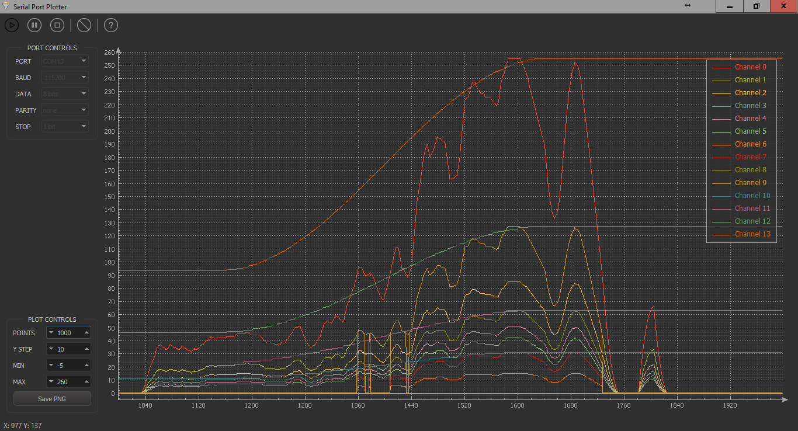

# Serial Port Plotter

This is a Windows application that displays real time data from serial port. The application is 32-bit and built with Qt and QCustomPlot library.

# Features
- No axes limit: An unknown/new channel data create a new graph and uses it
- 14 available line colors
- No data point limit: All received data is kept so user can explore old data
- Exports to PNG
- Zooming and dragging using the mouse wheel (X axis)
- Moving around the plot displays the X and Y values of the graph in the status bar
- Channel's name legend (double-click to modify)
- Channel selection (click on legend's text)

# Screenshot



# How to use the application

Just send your integer data over the serial port. The application expects certain format so it can differentiate between values. Each message you send must start with '$' and end with ';' (semi-colon) and the integers inside need to be space-separated. The Help button displays comprehensive instructions. Example: If you need to plot two values, use this code in your mbed source file:

# Send data over the serial port

```c
printf ("$%d %d (...) %d;", data1, data2, ..., datan);
```

Depending on how much data you want to display, you can adjust the number of data points. For example, if you send data from the serial port of the mbed every 10 ms (100 Hz) and the plotter is set to display 500 points, it will contain information for 5 seconds of data.

# Source

Source and .pro file of the Qt Project are available. A standalone .exe is included for the people who do not want to build the source. Search for it at [releases](https://github.com/CieNTi/serial_port_plotter/releases)

# Credits

- [Serial Port Plotter at mbed forums](https://developer.mbed.org/users/borislav/notebook/serial-port-plotter/) by [Borislav K](https://developer.mbed.org/users/borislav/ )
- [Line Icon Set](http://www.flaticon.com/packs/line-icon-set) by [Situ Herrera](http://www.flaticon.com/authors/situ-herrera)

# Changelog

All notable changes to this project will be documented below this line.
This project adheres to [Semantic Versioning](http://semver.org/).

## [Unreleased]
### Added
- Original qdarkstyle resources (icons are now working)
- Manifest and all Windows related/recommended configs
- [Line Icon Set] in 3 colors
- Inno Setup file with auto-pack .bat file (1st attempt)

### Changed
- Resources structure
- Updated qcustomplot to v1.3.2
- Menubar is replaced by icon toolbar for usability
- mainwindow.cpp comments are now doxygen friendly

### Fixed

### Removed

## [1.0.0] - 2014-08-31
### Added
- Original [Boris Kereziev](b.kereziev@gmail.com) work commit

Initial README and commit

[Unreleased]: https://link/to/diff
[1.0.0]: https://developer.mbed.org/users/borislav/notebook/serial-port-plotter/

# To-Do
- Fill baud automatically and allow custom by textbox (when COM ui)
- PNG +WITH+ transparency
- Port list refresh
